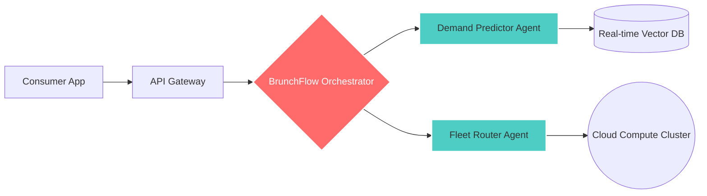

# 🥞 BrunchFlow AI: Autonomous Gastronomy Orchestrator

<div align="center">


**Next-Generation Intelligence for Global Food Systems**  
*Built by Brunch Bites LLC*

[Vision](#-the-vision) • [Architecture](#-system-architecture) • [Features](#-key-features) • [Quick Start](#-quick-start) • [Roadmap](#-roadmap)

</div>

---

## 🚀 The Vision

**BrunchFlow** is the flagship intelligence engine redefining urban food systems. In 2026, we believe food logistics should be as adaptive and intelligent as the people they serve. By integrating **LLM-driven decision making** with **Real-time Edge Logistics**, we solve the industry's most pressing bottlenecks.

## 🏗 System Architecture

The core of BrunchFlow is an autonomous orchestration layer that coordinates specialized agents to optimize the entire lifecycle of gastronomy commerce.



## ✨ Key Features

- 🧠 **Demand Forecasting:** Predictive AI reduces ingredient waste by up to 40% using regional sentiment analysis.
- 🛣️ **Logistics Mesh:** Real-time route optimization for autonomous delivery fleets via edge computing.
- 🍱 **Flavor RAG:** Retrieval-Augmented Generation for hyper-local menu optimization based on trending flavor profiles.
- 🔗 **Multi-Agent Protocol:** Seamless coordination between demand, inventory, and fulfillment agents.

## 🛠 Tech Stack (Cloud-Native)

- **Backend:** Python (FastAPI) & TypeScript (Node.js)
- **AI Infrastructure:** AWS Bedrock, GCP Vertex AI, and local GPU clusters.
- **Data layer:** Weaviate / Pinecone for vector indexing regional culinary data.
- **Deployment:** Docker, Kubernetes (K8s), and Terraform-managed infrastructure.

## ⚡ Quick Start

```bash
# Clone the repository
git clone https://github.com/Brunch-Bites/BrunchFlow-Core.git

# Install dependencies (Python)
cd BrunchFlow-Core
pip install -r requirements.txt

# Launch the orchestrator
python src/main.py --mode dev
```

## 🗺 Roadmap

- [x] **Phase 0:** Core Multi-agent coordination protocol logic.
- [/] **Phase 1:** Integration with real-time vector databases and regional data ingestion.
- [ ] **Phase 2:** Beta deployment for autonomous delivery pilot programs.
- [ ] **Phase 3:** Global scaling and API ecosystem launch.

---

<p align="center">
  © 2026 Brunch Bites LLC. <br>
  For partnership inquiries, contact <a href="mailto:contact@getbrunch.xyz">tony@getbrunch.xyz</a>
</p>
